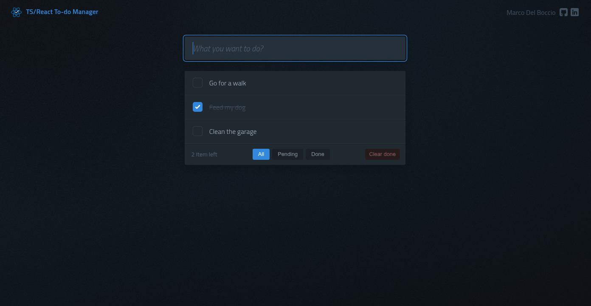

<div align="center">
  <a href="https://ts-react-todo-manager.netlify.app" target="_blank">
     
  </a>
  <h3 style="font-size:32px;">
    <strong>TS/React To-do Manager</strong>
  </h3>
  <p>Una aplicación interactiva de gestión de tareas, desarrollada con React y TypeScript. Con integración de Supabase para la autenticación de usuarios y la persistencia de datos personalizados. Este proyecto ha sido construido aplicando principios de diseño de componentes y buenas prácticas de tipado estricto, lo que resulta en una interfaz de usuario eficiente y una base de código clara y mantenible.</p>

<a href="https://ts-react-todo-manager.netlify.app" target="_blank">Live Demo</a>

  <div align="center">

[](https://www.typescriptlang.org/)
[](https://es.react.dev/)
[](https://zustand-demo.pmnd.rs/)
[](https://supabase.com/)
[](https://sass-lang.com/)
[](https://vitejs.dev/)
[](https://eslint.org/)

  </div>

</div>

## 🧪 Funcionalidades principales

- **Gestión de tareas**: Implementación completa de CRUD para tareas
- **Autenticación de Usuario**: Soporte de autenticación que permite la creación de usuario, inicio de sesión y recuperación de contraseña via email
- **Persistencia mejorada**: Los datos ahora se guardan en base de datos PostgreSQL a través de supabase, cada usuario maneja sus propios datos independientemente del dispositivo por el cual ingrese
- **Filtrado**: Filtros para visualizar tareas según su estado
- **Diseño responsivo**: Adaptable a diferentes tamaños de pantalla

## 📷 Galería


## 🧭 Guía de uso

### Autenticación

- **Registro de cuenta:** En la sección `/signup` se mostrará el formulario de creación de cuenta con los siguientes datos
  - **Username:** Nombre de usuario
  - **Email:** Correo electrónico que servirá para ingresar y recuperar contraseña
  - **Password:** Contraseña para iniciar sesión
- **Inicio de sesión:** En la sección `/login` se mostrará el formulario para inicio de sesión, rellenar los campos y presionar el botón
- **Recuperación de contraseña:** Para restablecer tu contraseña, ve a la sección `/login` y haz clic en el enlace "Forgot password?". Ingresa el correo electrónico asociado a tu cuenta. Recibirás un enlace por correo electrónico que te dirigirá a la página de creación de nueva contraseña. Una vez completado este proceso, podrás iniciar sesión con tu nueva contraseña.

### Gestión de Tareas

- **Crear tarea:** Haga click en el campo de texto, coloque un nombre para la tarea y presione `enter`
- **Editar tarea:** Haga doble click en el titulo de la tarea y coloque un nuevo nombre para la tarea
- **Completar tarea:** Haga click en el checkbox a la izquierda de la tarea para completar o descompletar la tarea
- **Eliminar tarea:** Coloque la flecha del mouse encima de la tarea que desea eliminar y haga click en la `x` al lado derecho de la tarea
- **Filtrar tareas:** Presione alguno de los botones de filtro al final de la lista de tareas
- **Limpiar tareas completadas:** Al tener tareas completadas aparecerá un botón "clear done" al presionarlo se borrarán todas las tareas completadas

## 📦 Estructura del proyecto

```
ts-react-todo-manager/
├── public/               # Archivos estáticos
├── src/
│   ├── assets/           # Recursos (SVGs, imágenes)
│   ├── components/       # Componentes React
│   ├── stores/           # Stores (Zustand)
│   ├── services/         # Servicios (Implementando Supabase sdk)
│   ├── adapters/         # Adaptadores
│   ├── supabase/         # Cliente de Supase SDK
│   ├── hooks/            # Custom hooks (localStorage, quotes)
│   ├── scss/             # Estilos SASS organizados por componentes
│   ├── App.tsx           # Componente principal
│   ├── constants.ts      # Constantes de la aplicación
│   ├── main.tsx          # Punto de entrada
│   └── types.d.ts        # Definiciones de tipos TypeScript
└── ...                   # Archivos de configuración
```

## 🚀 Instalación y uso

1.  Clona este repositorio:

    ```bash
    git clone https://github.com/codentide/ts-react-todo-manager.git
    cd ts-react-todo-manager
    ```

2.  Este proyecto utiliza Supabase para la autenticación de usuarios y la persistencia de datos, incluyendo la seguridad a nivel de fila (RLS) en la base de datos PostgreSQL. Las rutas para la recuperación de contraseña están configuradas tanto para el entorno de producción como para el de desarrollo. Necesitarás tus claves de proyecto de Supabase y definir las URLs de tus entornos.
    Crea un archivo .env en la raíz del proyecto con las siguientes variables:

        ```bash
        VITE_SUPABASE_URL="TU_SUPABASE_URL"
        VITE_SUPABASE_ANON_KEY="TU_SUPABASE_ANON_KEY"

        VITE_PROD_URL="https://tu-dominio" # URL de tu aplicación en producción
        VITE_DEV_URL="http://localhost:8080" # URL de tu aplicación en desarrollo
        ```

3.  Instala las dependencias:

    ```bash
    npm install
    # o con pnpm
    pnpm install
    ```

4.  Inicia el servidor de desarrollo:

    ```bash
    npm run dev
    # o con pnpm
    pnpm dev
    ```

5.  Abre tu navegador en `http://localhost:8080`

## 📄 Licencia

Este proyecto está bajo la Licencia MIT
